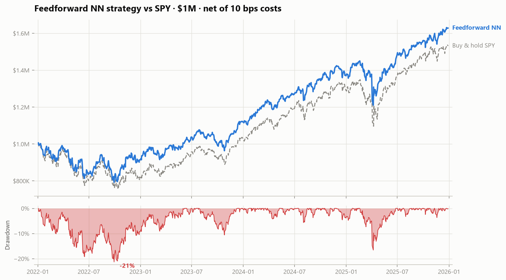

# Deep Learning Equity Signal — the result that inverted after costs

**Can deep learning beat a systematic fund's existing trading signal?**

<p align="center">
  
</p>

**$1,000,000 traded over a sealed 2022–2025 test period, net of 10 bps costs:**

| Strategy | Net Sharpe | P&L | Max drawdown | Turnover/yr |
|---|---|---|---|---|
| **Feedforward NN** | **0.85** | **+$627,692** | −21.3% | 4.3× |
| Equal-weight buy & hold | 0.88 | +$660,768 | −20.9% | ~0 |
| Buy & hold SPY | 0.69 | +$531,026 | −24.5% | ~0 |
| LSTM (60-day) | 0.35 | +$185,475 | −20.5% | 43× |
| **Linear model (incumbent)** | **−0.30** | **−$271,380** | −41.2% | 159× |
| 1D CNN (60-day) | −0.37 | −$324,557 | −38.9% | 246× |

### The headline: charging realistic costs reversed the ranking

The desk's incumbent signal looks profitable **gross** (+0.50 Sharpe) — but it trades
**159× its capital per year**, paying **$473,796** in fees over four years, which turns it
into a **−0.30 net Sharpe, value-destroying** strategy. Retiring it is worth roughly
**$118k/year in fees alone**, before any question of alpha. The selected network trades
4.3×/yr, so its Sharpe moves only 0.87 → 0.81 across a 0–25 bps cost sweep.

### The honest conclusion: ITERATE, not deploy

The best network clears the firm's 0.6 target and beats the S&P 500 — but **not**
equal-weight buy-and-hold (0.85 vs 0.88), and it holds **47.7 of 48 stocks** on an
average day. Most of its edge is a learned long bias that a bullish test period rewarded.
That isn't alpha, so it doesn't get capital yet. The four-week plan (cost-aware objective,
volatility-scaled sizing, long/short construction, FFNN+LSTM ensemble) is in the
[executive summary](reports/executive_summary.md).

### Methodology worth reading

- **The honest ceiling was set before any modeling.** Next-day return autocorrelation is
  **−0.105** — essentially noise — so 52–55% directional accuracy is the realistic maximum.
  Anything higher would indicate a bug. This is what stopped us celebrating one later.
- **Leak-freedom is proven, not asserted:** delete all data after a cutoff, recompute every
  feature, confirm the surviving rows are byte-identical.
- **Walk-forward validation across four market regimes** (COVID crash, 2022 bear, AI
  recovery, melt-up): **52.3% ± 0.5%**, gross Sharpe 0.59 ± 0.07.
- **Gradient attribution** shows the LSTM's **last 10 days carry 99% of its input
  influence** — effective memory is ~2 weeks regardless of the 60-day window, which is
  exactly why 20/40/60/120-day inputs all score the same.
- **The chart-reading ResNet-18 failed, and is reported as such:** 55.1% accuracy / AUC
  0.516 frozen and 49.2% / AUC 0.491 fine-tuned, against a 55.6% majority-class bar.

**Data:** 48 S&P 500 stocks, 2005–2025 (259,073 rows) plus VIX and the 10-year Treasury
yield. SPY and QQQ are reserved as benchmarks and never used as model inputs.

```bash
python predict.py --top 10     # today's signal, straight from raw prices
```

## Repository layout

```
.
├── data/
│   ├── sp500_stocks.csv          ← raw daily OHLCV, 50 tickers, 2005–2025
│   ├── vix.csv, treasury_10y.csv ← market context series
│   ├── processed/                ← model-ready parquet + predictions (built by nb 02–04)
│   └── chart_images/             ← candlestick images for transfer learning (built by nb 05)
├── notebooks/
│   ├── 01_eda.ipynb              ← two decades of market structure, and what it implies
│   ├── 02_preprocessing.ipynb    ← 17 leak-free features, temporal splits, scaling
│   ├── 03_feedforward_nn.ipynb   ← linear incumbent vs feedforward networks
│   ├── 04_sequence_models.ipynb  ← LSTM + 1D CNN, walk-forward validation
│   ├── 05_transfer_learning.ipynb← ResNet-18 on chart images + Grad-CAM
│   └── 06_backtest.ipynb         ← $1M, 10 bps costs, verdict
├── src/                          ← all reusable code (features, models, training, backtest…)
├── models/                       ← trained weights (.pt) and the fitted scaler (.pkl)
├── reports/                      ← executive summary, backtest report, model documentation
│   └── figures/                  ← every chart, publication-ready PNG
├── runs/                         ← TensorBoard logs (tensorboard --logdir=runs)
└── README.md
```

## The notebooks

Every notebook is committed with its outputs, so the results are readable without running anything.

| Notebook | What it covers | Fast view |
|---|---|---|
| [`01_eda.ipynb`](notebooks/01_eda.ipynb) | two decades of market structure, and what it implies | [open](https://nbviewer.org/github/kaustubhspatil/sp500-quantitative-deep-learning/blob/main/notebooks/01_eda.ipynb) |
| [`02_preprocessing.ipynb`](notebooks/02_preprocessing.ipynb) | 17 leak-free features, temporal splits, scaling | [open](https://nbviewer.org/github/kaustubhspatil/sp500-quantitative-deep-learning/blob/main/notebooks/02_preprocessing.ipynb) |
| [`03_feedforward_nn.ipynb`](notebooks/03_feedforward_nn.ipynb) | linear incumbent vs feedforward networks | [open](https://nbviewer.org/github/kaustubhspatil/sp500-quantitative-deep-learning/blob/main/notebooks/03_feedforward_nn.ipynb) |
| [`04_sequence_models.ipynb`](notebooks/04_sequence_models.ipynb) | LSTM + 1D CNN, walk-forward validation | [open](https://nbviewer.org/github/kaustubhspatil/sp500-quantitative-deep-learning/blob/main/notebooks/04_sequence_models.ipynb) |
| [`05_transfer_learning.ipynb`](notebooks/05_transfer_learning.ipynb) | ResNet-18 on chart images + Grad-CAM | [open](https://nbviewer.org/github/kaustubhspatil/sp500-quantitative-deep-learning/blob/main/notebooks/05_transfer_learning.ipynb) |
| [`06_backtest.ipynb`](notebooks/06_backtest.ipynb) | $1M, 10 bps costs, verdict | [open](https://nbviewer.org/github/kaustubhspatil/sp500-quantitative-deep-learning/blob/main/notebooks/06_backtest.ipynb) |

> GitHub renders large notebooks slowly and sometimes gives up with *"Sorry, something went wrong."* The **Fast view** column opens the same file through nbviewer, which loads reliably.

## Reproduce end-to-end

**1. Environment** (Python 3.11, NVIDIA GPU optional but recommended):

```bash
python -m venv venv && venv\Scripts\activate          # Windows
pip install numpy pandas matplotlib seaborn scikit-learn joblib pyarrow scipy \
            tensorboard pillow jupyter nbformat nbconvert ipykernel
# GPU (CUDA 12.6):
pip install torch torchvision --index-url https://download.pytorch.org/whl/cu126
# or CPU-only:
# pip install torch torchvision --index-url https://download.pytorch.org/whl/cpu
```

> **Windows note:** install into a venv at a *short path* (e.g. `C:\venvs\dl`) — PyTorch's
> package paths can exceed the 260-character Windows path limit inside deeply nested
> site-packages directories.

**2. Run the notebooks in order** (each persists what the next one loads):

```bash
jupyter notebook   # run 01 → 06 top to bottom
```

Or headless:

```bash
cd notebooks
for nb in 01_eda 02_preprocessing 03_feedforward_nn 04_sequence_models 05_transfer_learning 06_backtest; do
    python -m nbconvert --to notebook --execute --inplace $nb.ipynb
done
```

Approximate runtimes on an RTX 4060 laptop: 01–02 ≈ 2 min each, 03 ≈ 5 min,
04 ≈ 30 min (walk-forward retrains the LSTM four times), 05 ≈ 30 min
(first run also renders ~10k chart images), 06 ≈ 2 min.

**3. Watch training live (optional):**

```bash
tensorboard --logdir=runs
```

**4. Live inference demo** (the Day-10 presentation walkthrough) — takes raw
prices, runs the full pipeline, prints tomorrow's signal:

```bash
python predict.py --top 10
```

## Design decisions that matter

- **SPY and QQQ are benchmarks only** — never model inputs.
- **Strict temporal discipline everywhere:** train 2005–2018, validate 2019–2021,
  test 2022–2025; the scaler is fit on train only; sequence windows never cross the
  boundaries; notebook 02 *proves* the features are leak-free by recomputing them on
  truncated data.
- **Pooled panel:** all 48 stocks train one model per architecture (the EDA shows one
  dominant market factor, making pooling statistically reasonable and giving 160k+
  training rows).
- **Honest yardsticks:** directional accuracy is judged against always-long (~52%), not
  50%; Sharpe is judged net of 10 bps costs against SPY buy-and-hold; every claim is
  stress-tested across VIX regimes, four walk-forward folds, and a 0–25 bps cost grid.

## Deliberate deviations from the brief

Every one of these was a decision, not an omission. They are listed here so a
reviewer can challenge the reasoning rather than hunt for the gap.

| Brief says | What this project does | Why |
|---|---|---|
| Target = next-day **log** return | Simple returns end-to-end | At daily horizons the two correlate 0.9997 (median gap 0.0013 bp — measured in notebook 01 §3). Simple returns make the portfolio arithmetic *exact*: an equal-weight portfolio's return is the weighted mean of simple returns, and equity compounds as ∏(1+r). Log-return additivity would only matter for aggregating one asset across time, which nothing downstream does. |
| Indicators via the `ta` library, incl. **OBV** | 17 indicators hand-written in `src/features.py`; no OBV | Hand-built indicators are auditable, unit-testable, and provably trailing-only (notebook 02 proves it by recomputation) rather than trusting a third-party implementation. The set covers all six required families — momentum, volatility, oscillators, bands, trend, volume — with `volume_z` in place of OBV; OBV's cumulative construction adds a path-dependent level that the z-score captures more stably. |
| 70 / 15 / 15 split by row count | Calendar splits: 2005–18 / 2019–21 / 2022–25 (≈67/16/17) | Aligns split boundaries with market regimes and whole years, so the test period is a coherent economic era (bear → recovery → melt-up) rather than an arbitrary row index. Same discipline, more defensible boundaries. |
| Chart images from **30-day** windows | 60-day windows | Matches the sequence models' 60-day input, so the vision and LSTM experiments see the same amount of history and their results are directly comparable. |
| Walk-forward: expand by one **month** at a time | Four expanding folds of ~21 months each | Monthly refits over 2019–2025 would mean ~80 LSTM trainings for a model already shown to be near the noise floor. Four folds spanning distinct regimes (COVID crash, 2022 bear, AI recovery, melt-up) answer the actual question — *is the edge stable across market conditions?* — at 5% of the compute. Per-fold spread is reported, as the brief requires. |
| Feature extraction = "extract 512-d vectors, fit a logistic regression on them" | Frozen backbone + a trainable `nn.Linear(512, 2)` head, cross-entropy loss | These are the same model. A linear layer trained under cross-entropy *is* multinomial logistic regression on the 512-d features; doing it in-graph avoids materializing the feature matrix and keeps one inference path for both modes. |
| Optional: GRU comparison, Huber loss, embeddings, multi-seed runs | Not run | Out of scope once the core finding (signal ≈ noise floor; costs decide) was established. Each is listed in the executive summary's four-week iteration plan. |

## Deliverables

- [`reports/executive_summary.md`](reports/executive_summary.md) — one page, for the CIO
- [`reports/backtest_report.md`](reports/backtest_report.md) — full backtest, for the desk
- [`reports/model_documentation.md`](reports/model_documentation.md) — for model validation (OSFI E-23 style)
- `reports/figures/` — all charts at 150 dpi
